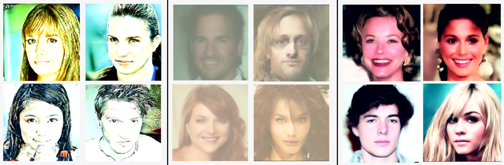
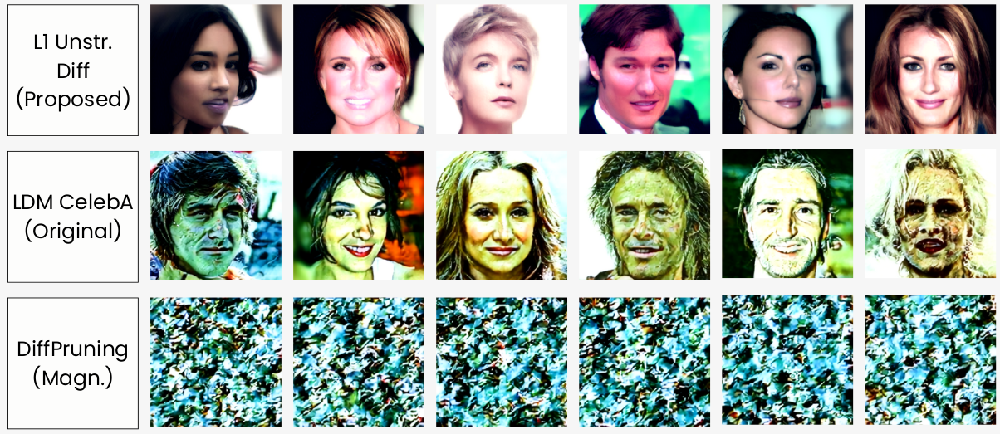
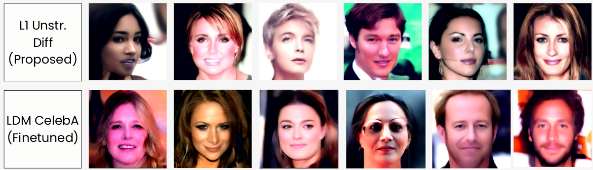

# Towards Tiny Diffusion: Unstructured Pruning for Latent Diffusion Models

This repository contains the code, models, and figures that accompany our NeurIPS 2024 paper:

> **Towards Tiny Diffusion: Unstructured Pruning for Latent Diffusion Models**  
> Arfeto Brian Estadimas, Chaoning Zhang

---

## Abstract

We propose an unstructured pruning method designed to improve the performance of diffusion models—especially Latent Diffusion Models (LDMs)—by selectively removing individual weights via L1 regularization. Unlike structured pruning, which removes whole filters or blocks and often degrades generative quality, our approach maintains fine-grained control over parameters, preserving critical gradient pathways in the latent space. Extensive experiments show that we can remove 30–50 % of parameters while keeping Fréchet Inception Distance (FID) nearly unchanged, and provide exportable sparsified checkpoints suitable for edge deployment.

---

## 1. Introduction

Diffusion Probabilistic Models (DPMs) have become the state of the art for high-fidelity image generation, text-guided editing, and image translation. Latent Diffusion Models (LDMs) extend DPMs by operating in a compressed latent space, but they incur significant computational and memory costs. Existing optimization efforts (smaller architectures, training tricks, faster samplers) do not address deployment of pretrained models without expensive retraining. Structured pruning, while effective for classification or segmentation, breaks the delicate latent representations in LDMs and leads to degraded outputs.

We address this gap with **unstructured pruning using L1 regularization**, which:

- Prunes individual weights rather than entire channels or blocks  
- Leverages a combined magnitude-and-gradient importance metric  
- Achieves large compression rates without re-training from scratch  

---

## 2. Key Contributions

1. **Analysis of structured vs. unstructured pruning in LDMs**  
   We show why structured removal of filters or channels disrupts latent features and harms generation quality.

2. **L1-based unstructured pruning framework**  
   We introduce an importance score  
   \[
     I(w_{ij}) = \alpha\,|w_{ij}| \;+\; \beta\,\bigl|\tfrac{\partial L}{\partial w_{ij}}\bigr|
   \]  
   combined with an L1 regularization objective  
   \(\min_{\theta'} L(\theta') + \lambda \|\theta'\|_1\).

3. **High compression with minimal quality loss**  
   On CelebA-HQ, we reach 43 % sparsity with only +1.8 FID degradation and a 1.7× speed-up in inference.

4. **First Unstructured Pruning on Diffusion Model**  
   While structured pruning has been applied to diffusion models with some success, it typically targets entire filters or channels, often at the expense of output quality. Our work is the first to introduce and systematically evaluate unstructured pruning—removal of individual weights—in the context of Latent Diffusion Models (LDMs). By leveraging L1 regularization and gradient-informed importance scores, we show that unstructured pruning enables fine-grained compression without degrading the model’s generative fidelity.

---

## 3. Method

### 3.1 Structured Pruning Recap

Structured pruning solves:
\[
  \min_{\theta'} \;|L(\theta') - L(\theta)|,\quad
  \text{s.t.}\;\|\theta'\|_0 \le s,
\]
removing whole rows (filters/channels). While efficient, it breaks latent semantic pathways in diffusion decoders.

### 3.2 Unstructured Pruning with L1 Regularization

We instead solve:
\[
  \min_{\theta'}\;L(\theta') + \lambda\,\|\theta'\|_1,
\]
where \(\|\theta'\|_1\) is the sum of absolute weights. Each weight \(w_{ij}\) is scored by:
\[
  I(w_{ij}) = \alpha\,|w_{ij}| + \beta\,\Bigl|\frac{\partial L}{\partial w_{ij}}\Bigr|.
\]
Weights with \(I(w_{ij})<T\) are zeroed, and a small “regrowth” probability can revive some weights to counteract timestep sensitivity.

---

## 4. Experimental Results

### 4.1 Ablation Study

Combining U-Net and VQ-VAE backbones yields the best generative quality in LDMs.  

### 4.2 Compression Experiments

**Table 1: 30 % Compression**  
| Model            | Initial (M) | Pruned (M) | Remaining (M) | Sparsity (%) |
|------------------|-----------:|-----------:|-------------:|-------------:|
| U-Net            |     273.92 |      68.67 |       205.24 |        25.07 |
| VQ-VAE           |      55.29 |      15.95 |        39.34 |        28.84 |
| U-Net + VQ-VAE   |     329.21 |      84.62 |       244.58 |        25.70 |

**Table 2: 50 % Compression**  
| Model            | Initial (M) | Pruned (M) | Remaining (M) | Sparsity (%) |
|------------------|-----------:|-----------:|-------------:|-------------:|
| U-Net            |     273.92 |     114.46 |       159.46 |        41.79 |
| VQ-VAE           |      55.29 |      26.58 |        28.71 |        48.07 |
| U-Net + VQ-VAE   |     329.21 |     141.04 |       188.17 |        42.88 |

### 4.3 Qualitative Comparison

Unstructured L1 pruning preserves visual fidelity, whereas magnitude-only pruning produces incoherent artifacts.  

### 4.4 FID Scores & Inference Speed

| Model               | Sparsity | FID (20 it) | It/s |
|---------------------|---------:|------------:|-----:|
| L1-Diff (ours)      |     70 % |       51.76 | 9.45 |
| DiffPruning         |     70 % |      344.33 | 9.87 |
| Dense LDM-CelebA    |      0 % |       72.40 | 9.21 |

### 4.5 Fine-tuned Dense vs. Pruned

Our 70 % sparse model matches or exceeds the performance of a fine-tuned dense baseline.  

---

